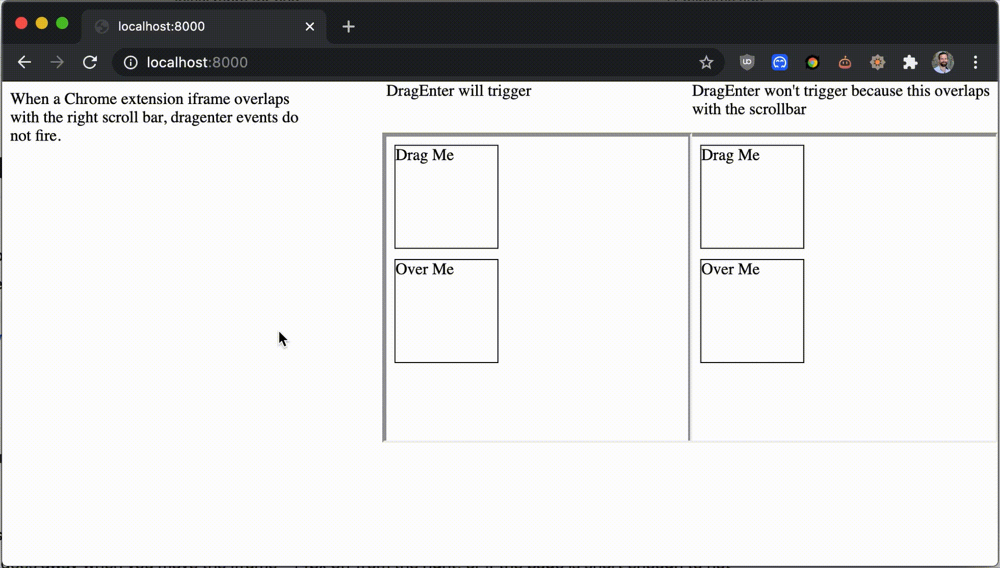

Repro for Chromium bug [#1105797](https://bugs.chromium.org/p/chromium/issues/detail?id=1105797)

# Instructions

1. Clone this repo
2. Go to chrome://extensions, click "Load unpacked", select test_extension dir
3. Note the extension ID, copy it into the two iframe URLs in `pages/index.html`
4. Run `node server.js` (creates an HTTP server on port 8000 to serve the 2 necessary files)
5. Visit [http://localhost:8000/](http://localhost:8000/)

# Example

# Things I've tried
* I can't figure out what it is about being a Chrome extension that causes issues: I cannot reproduce with a non-extension cross-origin iframe.
* I can't get this to happen in the Chrome extension directly, it seems to only happen in a sub-iframe that's not in the extension.
* The issue goes away when you move the iframe ~14px off from the right, or if the page is short enough to not have a scrollbar.
* The outer page's origin doesn't seem to matter: same, different origin, or direct file.
